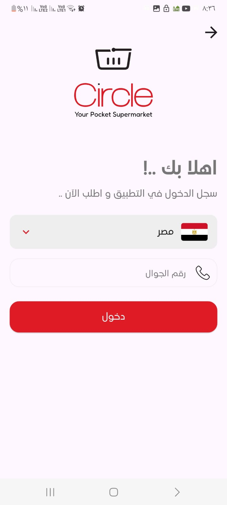
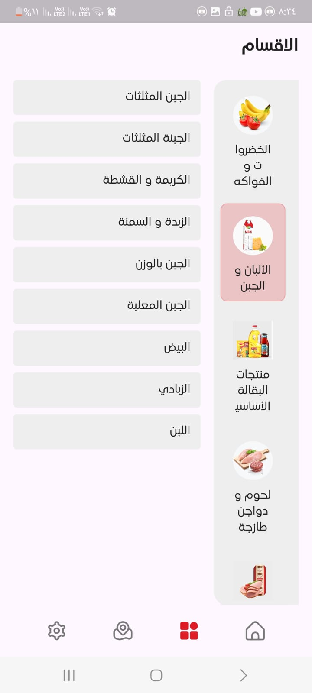
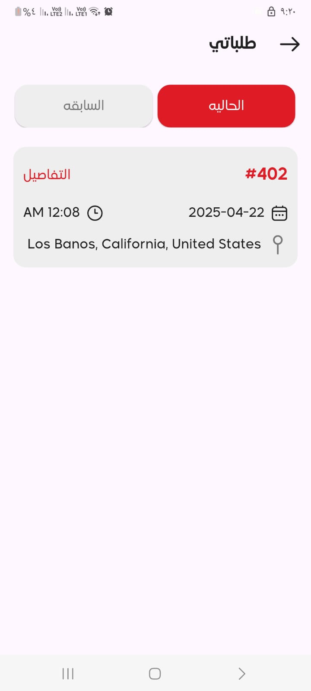
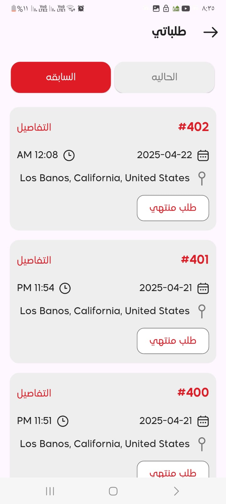
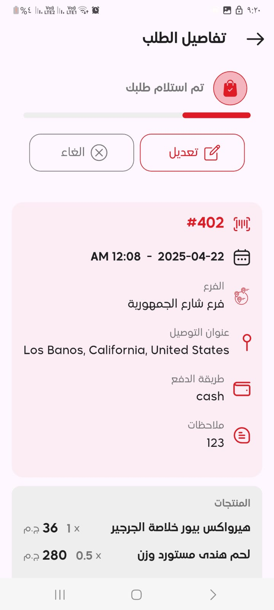
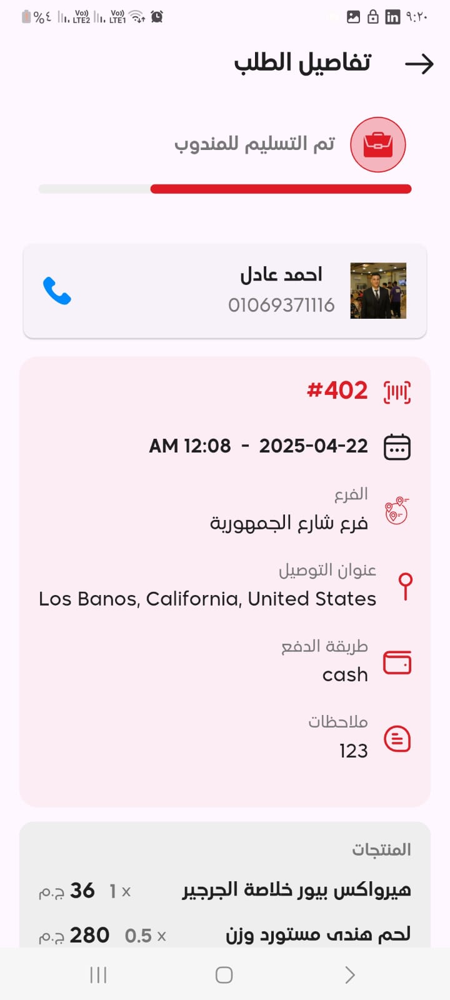
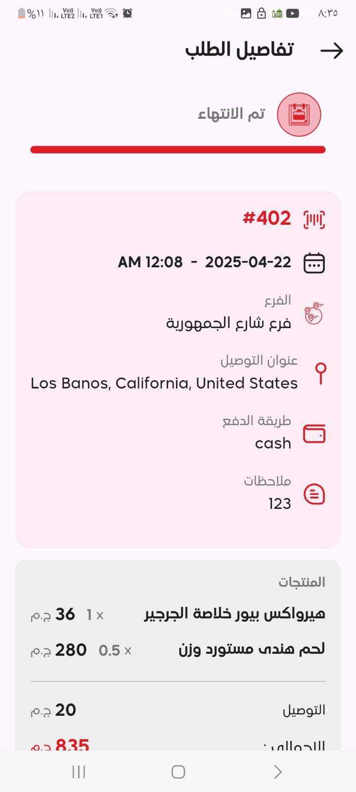
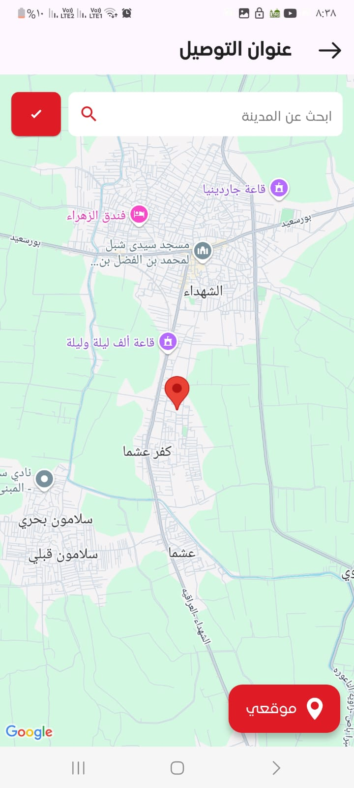
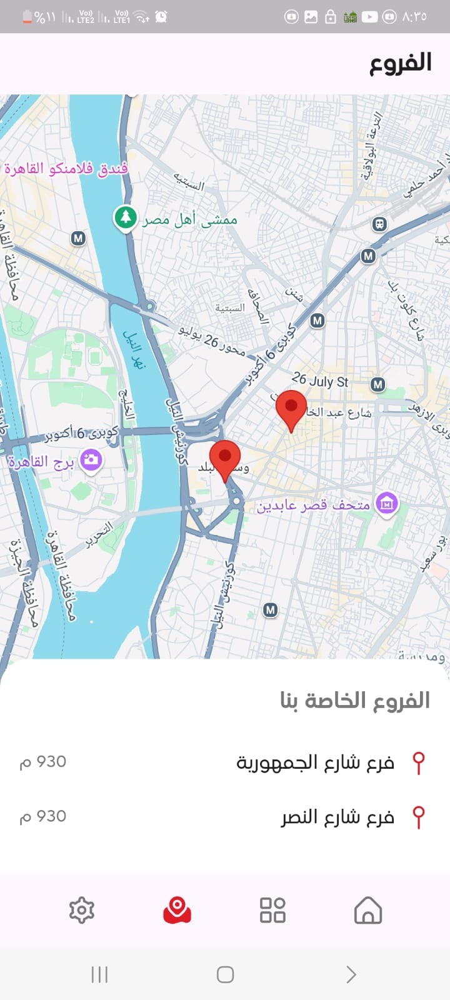

# Circle

An elegant and feature-rich e-commerce Flutter app enabling seamless shopping experiences.

## 🚀 Description

Circle is a modern mobile e-commerce application built with Flutter. It offers a comprehensive shopping platform where users can browse and search products by category and subcategory, manage a cart, calculate order totals, place and store orders, choose payment methods, mark favorites, and view store locations on Google Maps.

## ✨ Features

* **🛍️ Products**: Browse a catalog of products with images, descriptions, and prices.
* **📂 Categories & Subcategories**: Navigate products via organized category and subcategory hierarchies.
* **🛒 Shopping Cart**: Add, remove, and edit quantities of products in the cart.
* **💰 Order Calculation**: Real-time computation of subtotal, taxes, shipping fees, and total cost.
* **📦 Order Management**: Checkout flow to place orders and persist them in the backend.
* **💳 Payments**: Integrate payment gateway(s) for secure in-app transactions.
* **📍 Google Maps**: Display nearby store locations and delivery routes using Google Maps SDK.
* **❤️ Favorites**: Mark and view favorite products for quick access.
* **🔐 Authentication**: Login, register, and logout with secure token handling.
* **🔔 Notifications**: Push notifications for order status updates and promotions.
* **🌐 Localization**: Support for multiple languages (e.g., English, Arabic).


## 📸 Screenshots


| Auth Screen                          | Home Screen                                | Product Screen                              | Category Screen                            |
|------------------------------------|-------------------------------------------|---------------------------------------------|--------------------------------------------|
|  |  |  |  |

| Cart Screen                                                        | Order Screen                                                                                           | Place Order + Pay                                                  | Branch Locations                          |
|-------------------------------------------------------------------|-----------------------------------------------------------------------------------------------------|-------------------------------------------------------------------|--------------------------------------------|
|   |      |    |  |

| Language Selector                                         | Notifications                             |
|----------------------------------------------------------|------------------------------------------|
|    |  |


## 📦 Getting Startedzz

### Prerequisites

* Flutter SDK (>= 2.10.0)
* Dart (>= 2.17.0)
* Android Studio or Xcode
* (If using Firebase) A Firebase project with Auth, Firestore, and Storage enabled
* Google Maps API key
* Payment gateway credentials (e.g., Stripe, PayPal)

### Installation

1. **Clone the repository**:

   ```bash
   git clone https://github.com/ahmedAdelElmelegy/circle.git
   cd circle
   ```

2. **Fetch dependencies**:

   ```bash
   flutter pub get
   ```

3. **Configure environment**:

   * Create a `.env` file in the root or use `flutter_dotenv` and add:

     ```ini
     GOOGLE_MAPS_API_KEY=your_api_key_here
     PAYMENT_API_KEY=your_payment_key_here
     ```
   * (If using Firebase) Place `google-services.json` in `android/app/` and `GoogleService-Info.plist` in `ios/Runner/`.

4. **Run the app**:

   ```bash
   flutter run
   ```

## 🧹 Dependencies

### 🛠 Core

* [`flutter`](https://pub.dev/packages/flutter)
* [`dio`](https://pub.dev/packages/dio)
* [`dartz`](https://pub.dev/packages/dartz)
* [`equatable`](https://pub.dev/packages/equatable)
* [`get_it`](https://pub.dev/packages/get_it)
* [`provider`](https://pub.dev/packages/provider)
* [`shared_preferences`](https://pub.dev/packages/shared_preferences)
* [`hive`](https://pub.dev/packages/hive)
* [`hive_flutter`](https://pub.dev/packages/hive_flutter)

### 🌐 Network & Connectivity

* [`connectivity_plus`](https://pub.dev/packages/connectivity_plus)
* [`pretty_dio_logger`](https://pub.dev/packages/pretty_dio_logger)

### 📍 Location & Maps

* [`geolocator`](https://pub.dev/packages/geolocator)
* [`geocoding`](https://pub.dev/packages/geocoding)
* [`google_maps_flutter`](https://pub.dev/packages/google_maps_flutter)

### 🌍 Internationalization

* [`easy_localization`](https://pub.dev/packages/easy_localization)
* [`country_picker`](https://pub.dev/packages/country_picker)

### 🎨 UI & Animation

* [`cached_network_image`](https://pub.dev/packages/cached_network_image)
* [`card_swiper`](https://pub.dev/packages/card_swiper)
* [`dotted_border`](https://pub.dev/packages/dotted_border)
* [`dropdown_button2`](https://pub.dev/packages/dropdown_button2)
* [`dynamic_height_grid_view`](https://pub.dev/packages/dynamic_height_grid_view)
* [`flutter_screenutil`](https://pub.dev/packages/flutter_screenutil)
* [`flutter_svg`](https://pub.dev/packages/flutter_svg)
* [`lottie`](https://pub.dev/packages/lottie)
* [`pin_code_fields`](https://pub.dev/packages/pin_code_fields)
* [`shimmer`](https://pub.dev/packages/shimmer)
* [`page_transition`](https://pub.dev/packages/page_transition)

### 📸 Media & Assets

* [`image_picker`](https://pub.dev/packages/image_picker)

### 💬 UX

* [`fluttertoast`](https://pub.dev/packages/fluttertoast)
* [`url_launcher`](https://pub.dev/packages/url_launcher)
* [`flutter_google_places_hoc081098`](https://pub.dev/packages/flutter_google_places_hoc081098)

### 🚀 Dev & Tooling

* [`device_preview`](https://pub.dev/packages/device_preview)
* [`flutter_native_splash`](https://pub.dev/packages/flutter_native_splash)
* [`flutter_launcher_icons`](https://pub.dev/packages/flutter_launcher_icons)
* [`flutter_lints`](https://pub.dev/packages/flutter_lints)

## 📁 Folder Structure

```
lib/
├── core/
│   ├── di/             # Dependency injection setup
│   ├── error/          # Error and failure classes
│   ├── helpers/        # Utility classes and methods
│   ├── theme/          # Light and dark theme definitions
│   ├── utils/          # App-wide constants, enums, etc.
│   └── widgets/        # Common reusable widgets
│
├── data/
│   ├── api_url.dart    # Base URLs and endpoint paths
│   ├── datasource/     # Remote and local data source implementations
│   ├── models/         # Data models (ProductModel, UserModel, etc.)
│   ├── provider/       # Data layer providers or notifiers
│   └── repo/           # Repository interfaces and implementations
│
├── features/
│   ├── auth/           # Authentication screens and logic
│   ├── cart/           # Cart feature
│   ├── home/           # Home, banners, and popular items
│   ├── lang/           # Language selector UI
│   ├── maps/           # Google Maps integrations
│   ├── notification/   # Notifications feature
│   ├── order/          # Orders management and history
│   ├── place_order/    # Checkout and payment
│   ├── product/        # Product list, details, and categories
│   └── widgets/        # Feature-specific reusable widgets
│
└── main.dart           # App entry point
```

## 🤝 Contributing

Contributions are welcome! Please follow these steps:

1. Fork the repository
2. Create a new branch (`git checkout -b feature/YourFeature`)
3. Commit your changes (`git commit -am 'Add some feature'`)
4. Push to the branch (`git push origin feature/YourFeature`)
5. Open a Pull Request


*Happy coding!*
